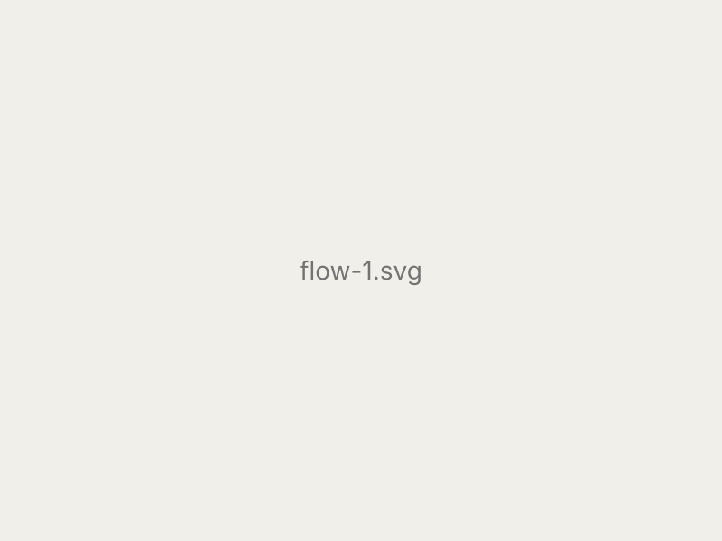
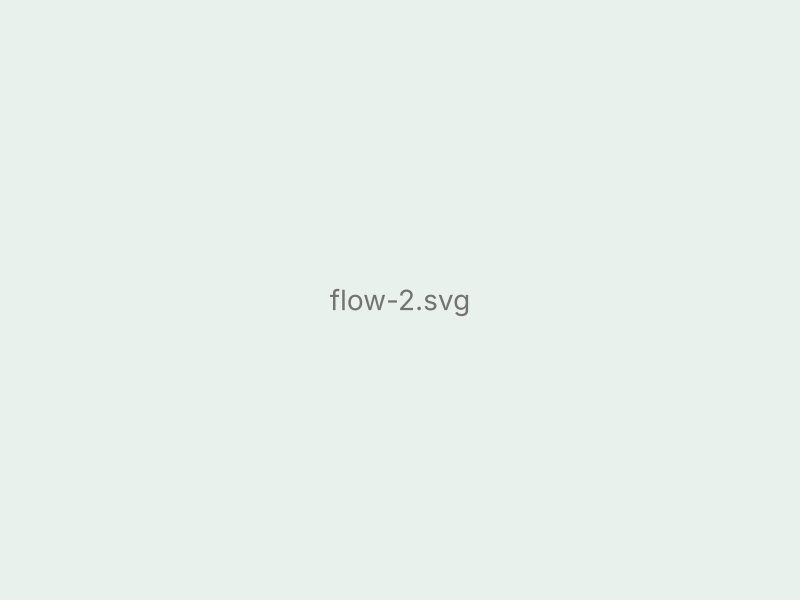
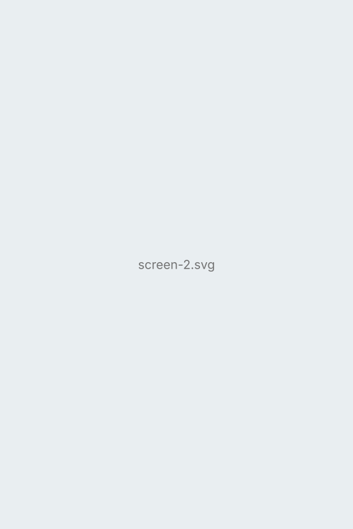

---
# Copy this whole folder to start a new project, rename the folder (it becomes the URL),
# then replace the images and text.
# A folder name starting with "_" (like this one) is a DRAFT: visible while running
# `npm run dev`, left out of the live site. Remove the "_" when it is ready to publish.
title: "Example Project"
category: ux                 # mr | ux | 3d-motion  (see content/design-categories.yml)
type: "UX Research"          # small label above the title on the card
summary: "A template showing every layout block you can use on a project page."
cover: "cover.svg"           # card image: .png / .jpg / .gif / .webp, or a .mp4 (plays silently on loop)
year: 2026                   # optional — shown under the title
role: "UX Researcher, Designer"
tools: "Figma, Unity, Maya"
order: 0                     # smaller = earlier in its category
---

Regular paragraphs are plain text. You can use **bold**, *italic*, and [links](https://example.com). Text stays at a comfortable reading width, while images and videos span the whole page.

## Full-width image

An image on its own line fills the page. GIFs work exactly the same way: ``.

## Image with a caption

<figure>
  
  <figcaption>Captions go in figcaption, centered under the media.</figcaption>
</figure>

## Side by side

Wrap images in a `row` to put them next to each other — two, three, or more. On phones they stack.

  
  

  
  
  

## Video

Put the video file in this folder and use one of these (remove the `<!-- -->` around it):

<!--
Plays silently on a loop, like a GIF (good for short UI demos):
<video src="demo.mp4" autoplay muted loop playsinline></video>

Normal video with play / pause controls:
<video src="walkthrough.mp4" controls></video>

YouTube (use the /embed/ link):
<iframe src="https://www.youtube.com/embed/VIDEO_ID" allowfullscreen></iframe>

Bilibili:
<iframe src="https://player.bilibili.com/player.html?bvid=BV_ID&autoplay=0" allowfullscreen></iframe>
-->

Videos and images can also go inside a `row` or a `figure`.

## Process

### Lists

- Research and interviews
- Wireframes and prototypes
- Usability testing

> Quotes from participants look like this.

---

A horizontal line (`---`) separates larger parts of the story.
